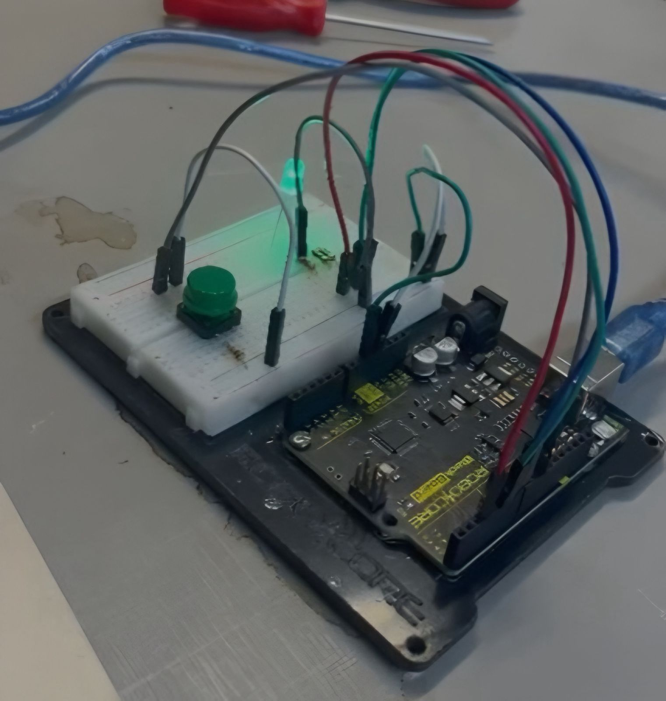

# PlugPilot ⚡

PlugPilot é um sistema de gerenciamento de carregadores para veículos elétricos, desenvolvido com foco em monitoramento, reservas e melhor aproveitamento dos pontos de recarga.

O projeto surgiu da observação de que o problema não está apenas na quantidade de carregadores disponíveis, mas também na forma como eles são utilizados. Muitas vezes um veículo continua ocupando a vaga mesmo após concluir a recarga, reduzindo a disponibilidade para outros motoristas.

Nosso objetivo é tornar o uso desses carregadores mais eficiente tanto para empresas quanto para usuários.

---

## Objetivo

O PlugPilot possui dois públicos principais:

### B2B

Empresas e estabelecimentos que disponibilizam carregadores em seus espaços.

Com o sistema, é possível acompanhar:

* carregadores cadastrados
* reservas realizadas
* status dos carregadores
* informações operacionais básicas

### B2C

Motoristas de veículos elétricos.

Com o sistema, o motorista pode:

* visualizar carregadores disponíveis
* realizar reservas
* cancelar reservas
* acompanhar disponibilidade em tempo real

O diferencial do projeto está na integração com hardware Arduino, permitindo validação física do uso real do carregador.

---

## MVP atual

Atualmente o projeto conta com:

* cadastro e login de usuários
* diferenciação entre motorista e empresário
* CRUD de carregadores
* CRUD de unidades
* sistema de reservas
* dashboard empresarial básico
* persistência de dados em JSON
* integração inicial com Arduino

---

## PlugFlow | Protótipo Arduino

PlugFlow é o módulo de hardware do PlugPilot.

### Fase 1

* botão
* LED RGB
* simulação de carregador disponível ou ocupado



### Fase 2

* comunicação serial entre Arduino e Python


### Fase 3

* leitura de corrente elétrica por sensor


### Fase 4

* integração completa entre software e hardware


---

## Tecnologias utilizadas

* Python
* JSON
* SQLite *(migração planejada)*
* Arduino
* PySerial
* Matplotlib
* NumPy

---

## Como executar

```bash
git clone https://github.com/PlugPilot-G8/PlugPilot.git
cd PlugPilot
pip install -r requirements.txt
python main.py
```

---

## Equipe

| Nome                                    |
| --------------------------------------- | 
| Antônio Marcos Soares de Araújo Filho   | 
| Carlos Frederico Chaves Gomes Filho     | 
| Guilherme Fonteles Matos da Silva       |
| Lucas Soares Pereira                    | 
| Pedro Henrique Peixoto Campelo          | 
| Pedro Otávio Gomes de Moura Silva       | 
| Victor Bacelar Palazzin                 | 

---